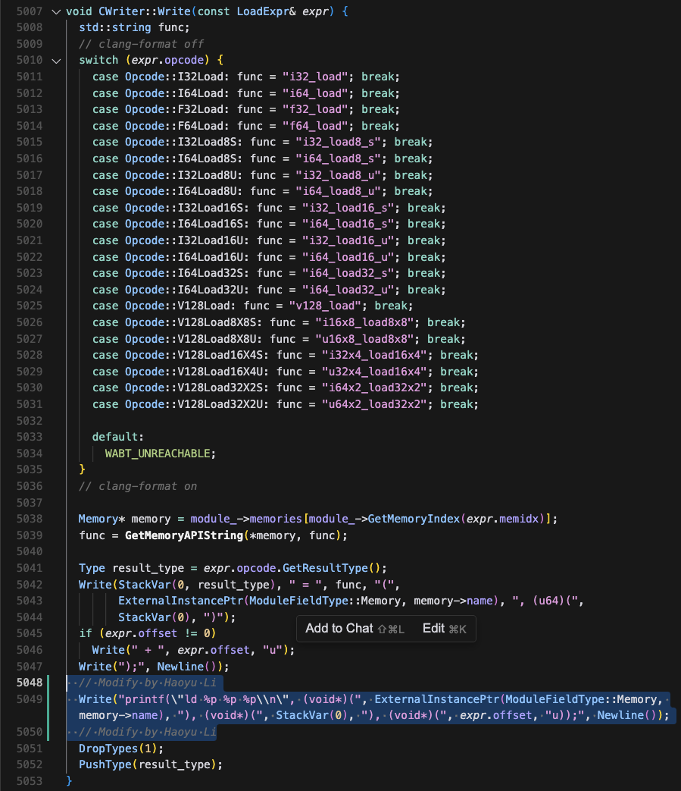
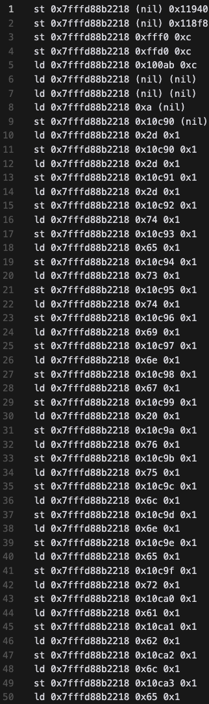
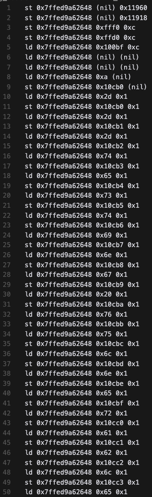
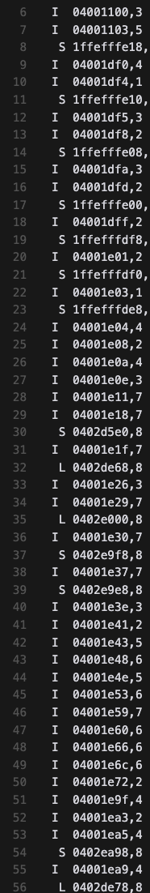
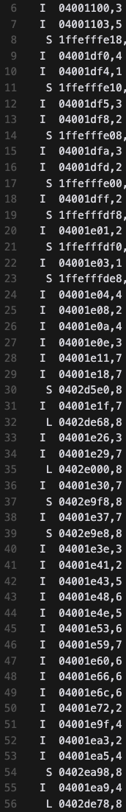
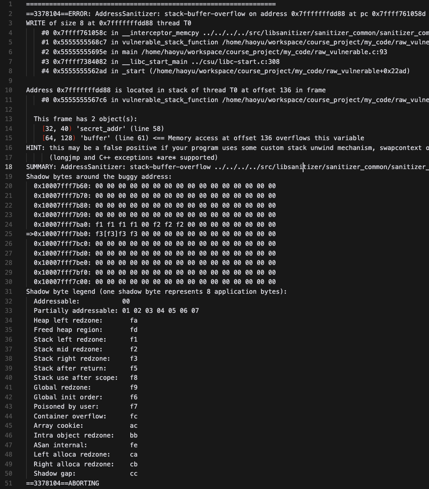
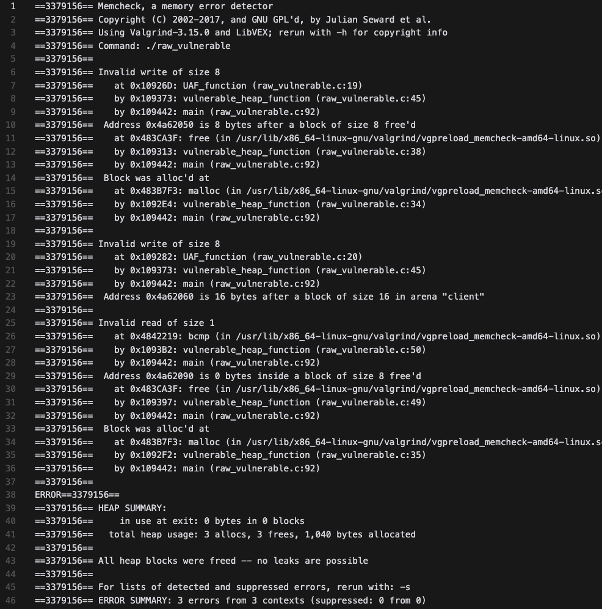
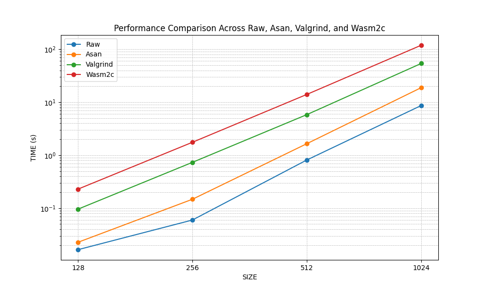

# Course Project Midterm Report

## **Project Selection from Syllabus**

```
Modify wasm2c to trace all memory accesses, record it to file, and calculate the diff of two different memory traces of a program. Wasm2c is a compiler that compiles Wasm binaries to native code by first compiling WebAssembly files to C code, and then compiling C code with a standard C compiler. You can modify Wasm2c to record every memory load and store operation to the WebAssembly heap, and save this to a file. By running this modified Wasm2c to two different executions of a program, you can identify memory accesses that differ between two traces of a program. Such tools allow developers to identify where program executions differ for different inputs. Build this tool that records two traces and then diffs the two traces, and identify the memory access that differs between the two traces.

Skills: Comfortable with C++.

Level of difficulty: Easy/Moderate.
```

## **Walkthrough**

In this repo, we write a vulnerable program `raw_vulnerable.c` and use `emcc` to compile it to `vulnerable.wasm`. Then we use `wasm2c` to compile `vulnerable.wasm` back to C code to check the security properties. Our measurement includes the following aspects:

1. Memory Access. What is the difference between the raw C program and the wasm2c program in terms of memory access?

2. Error Detection and Avoidance. Compare the ability of the raw C program and the wasm2c program to detect errors. In this report, we `focus on UAF` and `stack overflow`.

3. Time Cost. Does different tricks incur much different time cost?

### Tools:

We use the following to conduct this project:

- `emcc` to compile the C code to WebAssembly.
- `wasm2c` to compile the WebAssembly to C code.
- `valgrind` Valgrind is a specialized runtime tool to check memory errors, It intercepts all memory accesses, system calls, and CPU instructions of the program during execution. Typically, it will significantly slow down the program.
- `asan` Address Sanitizer is also a memory error detector. It inserts checking instructions during compilation to record memory access and uses shadow memory to reduce the memory overhead, which is much faster than valgrind.

### Brief Results:

1. Memory Access.

We find that the memory access after using `wasm2c` is not fixed. When we run the same program for many times, we find the memory access are the same offsets plus some unfixed indexes. This unfixed indexes, aka the boundary of the wasm2c sandbox, is different each time. In contrast, the raw C program has a fixed memory access every time we measure it using `valgrind`. You can refer to the `memtrace` folder for more details.

2. Error Detection and Avoidance.

Given that the raw C program can be vulnerable to both UAF and stack overflow (we need some specific configurations to trigger them), we find that both valgrind and asan can help detect and avoid them. However, `wasm2c` can only abort the program when the memory access exceeds the sandbox boundary. You can refer to the `errordetection` folder for more details.

3. Time Cost.

We test the performance using a matrix multiplication program (we initialize two random matrices A[SIZE][SIZE] \* B[SIZE][SIZE] and calculate C[SIZE][SIZE] = A \* B). The results show that `valgrind` will significantly slow down the program (>10x), while `asan` will only slow down the program by no more than 3x. Interestingly, `wasm2c` will slow down the program by 20x, which is out of our expectation. We have no idea whether it is normal or not. The result is shown in the figure in `perftest` folder.

## Details

### Experiment 1: Memory Access.

To record the memory access, in this experiment, we modify the `wabt/src/c-writer.cc: void CWriter::Write(const LoadExpr& expr)` function to let the generated C code print the memory access. 



We run a wasm2c runtime (main.c) to accommodate the program (raw_vulnerable.c): 

```bash
emcc -O0 -g -o vulnerable.wasm raw_vulnerable.c && wasm2wat vulnerable.wasm -o vulnerable.wat && make && ./vulnerable && rm -rf vulnerable.wasm vulnerable.wat vulnerable vulnerable.c vulnerable.h vulnerable.o main.o
```

The results are shown below. The left two columns are the memory access of wasm2c, and you can find that the memory access is a mixture of fixed offsets and some unfixed indexes. The index is typically determined by the runtime when calling the `wasm_rt_allocate_memory` function. In contrast, the raw C program has a fixed memory access every time we measure it using `valgrind`, which is shown in the right two columns.

<p align="center">
    
    
    
    
</p>

### Experiment 2: Error Detection and Avoidance.

In the second experiment, we test the ability of the raw C program and the wasm2c program to detect errors. We focus on `UAF` and `stack overflow`.

```C
// This code tests the UAF error.
// UAF function is called after the buffer_1 is freed and modify the memory at buffer_2 from SAFE to UNSAFE.

void UAF_function(void *buffer_1)
{
    memcpy(buffer_1 + 16, UNSAFE, 8);
    memcpy(buffer_1 + 32, UNSAFE, 8);
}

void vulnerable_heap_function()
{
    vulnerable_put("\n---testing vulnerable_heap_function---\n");
    void *buffer_1 = malloc(8);
    void *buffer_2 = malloc(8);

    memcpy(buffer_2, SAFE, 8);
    free(buffer_1);
    vulnerable_put("SAFE before UAF: ");
    vulnerable_put((char *)buffer_2);
    vulnerable_put("\n");
    if (memcmp(buffer_2, SAFE, 8) != 0)
        printf("ERROR");

    UAF_function(buffer_1);

    vulnerable_put("SAFE after UAF: ");
    vulnerable_put((char *)buffer_2);
    free(buffer_2);
    if (memcmp(buffer_2, UNSAFE, 8) != 0)
        printf("ERROR");

    vulnerable_put("\n");
}
```


```C
// This code tests the stack overflow error. The buffer simulates the scenario that user can input a long string. When the input overwrites the saved return address, the program will jump to the secret_stack_function.

void secret_stack_function()
{
    printf("%s\n", output_str);
    exit(0);
}

void vulnerable_stack_function()
{
    uintptr_t secret_addr = (uintptr_t)&secret_stack_function;
    
    vulnerable_put("\n---testing vulnerable_stack_function---\n");
    char buffer[64];
    vulnerable_put("Please do not print anything longer than 64 characters!\n");
    vulnerable_put("Your input: ");
    
    for (int i = 0; i < 64; i++) {
        buffer[i] = 'A';
    }
    memcpy(buffer + 72, &secret_addr, sizeof(secret_addr));
    vulnerable_put(buffer);
}
```

To trigger the errors, we disable the randomization of the stack and use `-fno-stack-protector` to disable the stack protection. The result shows that the raw C program can detect the UAF error and the stack overflow error.
```bash
echo 0 | sudo tee /proc/sys/kernel/randomize_va_space
gcc -fno-stack-protector -g -o raw_vulnerable raw_vulnerable.c -lpthread && ./raw_vulnerable && rm -rf raw_vulnerable
echo 2 | sudo tee /proc/sys/kernel/randomize_va_space
```
```txt
// Output of the raw C program

---testing vulnerable_heap_function---
SAFE before UAF: SAFE
SAFE after UAF: UNSAFE

---testing vulnerable_stack_function---
Please do not print anything longer than 64 characters!
Your input: AAAAAAAAAAAAAAAAAAAAAAAAAAAAAAAAAAAAAAAAAAAAAAAAAAAAAAAAAAAAAAAA�RUUUU
Oops! You are hacked!
```

The UAF error also happens in the wasm2c program. However, we cannot reproduce the stack overflow error in the wasm2c program (though the program is not aborted). We suspect that the reason is that the wasm2c puts the return address in some else place. We then test what a overflow size can trigger the segmentation error. The result shows that the raw C program throws an error when the overflow size larger than one page (4K), whereas the wasm2c program can run without any error until the size reaches 16MB. We still don't know what the memory allocation strategy of the wasm2c program is.

<p align="center">
    
    
</p>

When using ASan (left) and Valgrind (right), we can easily detect the two errors.


**Error Vulnerability Comparison**:


`valgrind`, `asan` > `wasm2c` > `raw C`


### Experiment 3: Time Cost.



We write a matrix multiplication program in C and test the time cost of different tools. The result is shown in the figure below. It is reasonable that `valgrind` will significantly slow down the program because it needs to simulate the program to check every memory access. However, we cannot understand why `wasm2c` is the slowest. It is probably because the wasm2c library adds too many additional instructions (macro, function call, etc.). However, this overhead seems still weird.

**Performance Comparison:**

`valgrind` > `asan` > `wasm2c` > `raw C`

### Conclusion

In this report, we test the performance and error detection ability of the wasm2c tool. The primary experiments show that the wasm2c tool is both not error-free and performant. We guess we need to run more benchmarks and test more error cases to get a better understanding of the wasm2c tool.